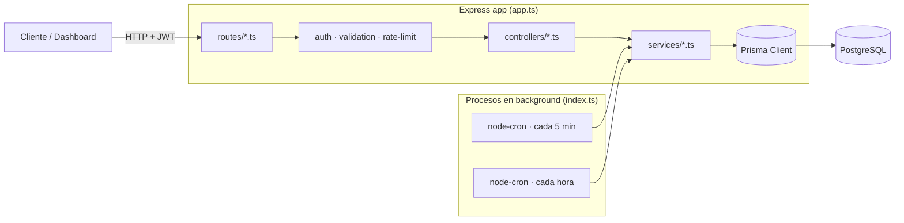

# Arquitectura

## Vista general



Cada request sigue el mismo camino: **routes → middlewares → controller (delgado) → service (lógica de negocio) → Prisma**. Los controllers no tocan Prisma directamente ni contienen reglas de negocio — solo parsean el request, llaman al service, y formatean la respuesta.

## Estructura de carpetas

```
src/
├── config/         # environment (lee .env), database (singleton de PrismaClient), swagger
├── middlewares/    # authMiddleware (JWT), validation (Joi genérico), errorHandler (centralizado)
├── routes/         # un router por módulo + anotaciones @openapi
├── controllers/    # capa HTTP delgada — parsea req, llama al service, formatea res
├── services/       # TODA la lógica de negocio vive aquí
├── validators/     # esquemas Joi (uno por módulo) + pagination.ts compartido
├── utils/          # jwt, password, dateHelpers, recurrence, pagination, timezone, logger, errores
├── jobs/           # schedulers de node-cron (notificaciones, expiración de metas)
├── app.ts          # arma la app de Express (sin listen) — lo importan los tests
└── index.ts        # entry point real: listen() + arranca los schedulers
```

## Por qué `app.ts` está separado de `index.ts`

`app.ts` exporta la app de Express ya configurada, sin llamar a `.listen()`. Los tests de integración importan `app.ts` y la pasan a Supertest, que abre su propio servidor efímero — así los tests nunca compiten por el puerto 3000 ni dependen de que el proceso real esté corriendo. `index.ts` es el único archivo que llama `app.listen()` **y** el único que arranca los schedulers de `jobs/` — importar `app.ts` en un test nunca levanta un cron de fondo por accidente.

## Autenticación

JWT de dos tokens: `token` (access, expira en `JWT_EXPIRES_IN`, default 1h) y `refreshToken` (expira en `JWT_REFRESH_EXPIRES_IN`, default 7d), firmados con secretos distintos (`src/utils/jwt.ts`). **Stateless**: no hay tabla de refresh tokens en BD, así que no hay forma de revocar uno antes de que expire por sí solo (ni un `/auth/logout` real, server-side). Si se necesita revocación (p.ej. "cerrar sesión en todos los dispositivos"), habría que añadir una tabla `RefreshToken` con un flag `revoked`.

`authMiddleware` valida el `Bearer <token>` y expone `req.userId`/`req.userEmail`; todo endpoint protegido lo usa para filtrar por dueño.

## Autorización por recurso

No hay roles ni permisos granulares — cada usuario solo ve lo suyo. El patrón se repite en cada service: `findOwned*(userId, id)` busca el recurso, lanza `NotFoundError` (404) si no existe, y `ForbiddenError` (403) si `resource.userId !== userId`. Ver por ejemplo `agendaService.ts::assertOwnership` o `projectsService.ts::findOwnedTask`.

## Manejo de errores

`src/utils/errorHandler.ts` define `AppError` y sus subclases (`NotFoundError`, `ForbiddenError`, `UnauthorizedError`, `ValidationError`, `ConflictError`), cada una con su `statusCode`. Los services lanzan estos errores; `src/middlewares/errorHandler.ts` (middleware final de Express) los captura y responde con el JSON `{ error: message }` correspondiente. Errores de Prisma conocidos (`P2002` unique constraint, `P2025` not found) se traducen a 409/404 automáticamente como red de seguridad, aunque en la práctica los services ya validan antes de llegar ahí.

> Nota histórica: `AppError` tuvo un bug real donde `Object.setPrototypeOf(this, AppError.prototype)` en el constructor rompía `instanceof` en las subclases — ver [TESTING.md](TESTING.md#bugs-reales-que-atraparon-los-tests) para el detalle.

## Schedulers en proceso

Dos cron jobs (`node-cron`, in-process — no hay cola externa tipo Redis/BullMQ) arrancados desde `index.ts`:

| Job | Frecuencia | Qué hace |
|---|---|---|
| `notificationScheduler` | cada 5 min | `event_reminder` (evento en ~30 min) + `goal_at_risk` (meta que no llegaría a tiempo) |
| `goalExpiryScheduler` | cada hora | archiva metas con `periodEnd` pasado (`expired=true`) y crea la del siguiente periodo si `autoRenew` |

Ambos son **idempotentes** por diseño: correr el mismo check dos veces no duplica notificaciones (dedup por `relatedId`+`occurrenceAt`, o por "ya hay una sin leer") ni duplica metas (una vez `expired=true`, el `where` ya no la vuelve a traer). Esto importa porque un proceso puede reiniciarse entre ticks, o el propio cron puede solaparse si un tick tarda más de lo esperado.

## Eventos recurrentes: expansión virtual

Un evento con `isRecurring=true` sigue siendo una sola fila en `Event`. Las ocurrencias futuras se calculan en memoria (`src/utils/recurrence.ts::expandRecurringEvent`) al consultar `GET /agenda/day` o `/agenda/week`, nunca se guardan como filas nuevas. Ventaja: cero migraciones, y editar/borrar la plantilla afecta automáticamente a toda la serie. Limitación aceptada: no hay excepciones por ocurrencia individual (no puedes mover "solo el martes que viene" sin afectar a toda la serie semanal).

El scheduler de recordatorios necesita una variante distinta (`nextOccurrenceStartingIn`) — ver [TESTING.md](TESTING.md#bugs-reales-que-atraparon-los-tests) para por qué reutilizar la misma función para ambos casos era un bug.

## Zonas horarias

`User.timezone` (zona IANA, ej. `Europe/Madrid`) determina los límites de "hoy" y "esta semana" en Agenda. `src/utils/dateHelpers.ts` usa `date-fns-tz` para convertir "medianoche en la timezone del usuario" al instante UTC real, en vez de usar la hora local del servidor — importante porque un servidor desplegado en UTC (como Railway/Render por defecto) calcularía "hoy" desalineado en las horas límite (23:00–01:00) respecto a un usuario en Madrid. El resto de módulos (Finanzas, Metas) todavía calculan meses/periodos con la hora del servidor — mismo tipo de inconsistencia potencial, no corregida aún fuera de Agenda.

## Optimización de queries

Varios endpoints de Finanzas se reescribieron para evitar N+1: `getAnnualBalance` pasó de 24 consultas (12 meses × 2 `aggregate`) a 1 sola con bucketing en memoria; `getAnalytics` de 13 a 1; `listSavingsGoals` de `2×N` (N = nº de metas de ahorro) a 2 fijas con `groupBy`. Ver el detalle en el historial de `src/services/financeService.ts`.

## Rate limiting y hardening

- Límite general configurable (`env.rateLimit.*`) para toda la API, y uno más estricto (20 req/15min) solo en `/auth` contra fuerza bruta — ambos desactivados en `NODE_ENV=test`.
- `express.json({ limit: "100kb" })` — tope de tamaño de body.
- `trust proxy` solo en producción (necesario para que `express-rate-limit` vea la IP real detrás del proxy de Railway/Render).
- Helmet + CORS configurado vía `CORS_ORIGIN`.
